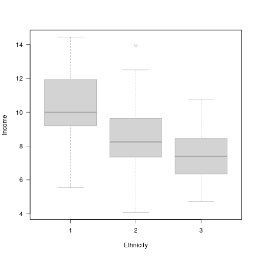
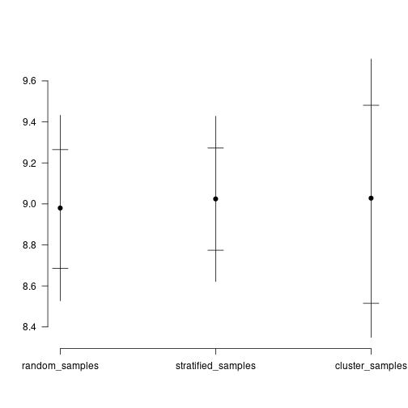

# 2. Scientific Data Gathering: Monte Carlo Exercises

Function from the `Bolstad` package can be used to perform random draws.
But it is really easy to do this in base R.

## Function preparation

With the power of editing and hindsight, we first prepare some useful functions for this exercise.


```r
# Turn `sample` into S3 generic and make a function for stratified sampling
sample = function(x, size, replace = FALSE, ...){
    UseMethod("sample")
    }

sample.default = base::sample

sample.data.frame = function(x, size, replace = FALSE, split = NULL){
    if(is.null(split))
        return(x[sample(x = nrow(x), size = size, replace = replace),])

    i = split(nrow(x) |> seq_len(), f = split)
    s = Map(sample, x = i, size = size, replace = replace) |> unlist()
    x[s,]
    }

# S3 methods to get proportions out of various objects
proportions = function(x, ...){
    UseMethod("proportions")
    }

proportions.default = function(x){
    table(x, dnn = NULL) |> prop.table() |> c()
    }

proportions.data.frame = function(x, select){
    x[[select]] |> proportions()
    }

proportions.list = function(x, select = NULL){
    lapply(x, proportions, select = select)
    }


# shorthand for applying identical to list of vectors
all_identical = function(x, what, f = all){
    sapply(x, function(y) identical(y, what)) |> f()
    }
```

## 2.1 Monte Carlo study comparing methods for random sampling

Population is made up of 100 individuals divided into three ethnic groups and twenty neighbourhoods. We are interested in average income calculated from a random sample of size 20.

The data are available in the `Bolstad` package (on CRAN).


```r
if(!requireNamespace("Bolstad"))
    install.packages("Bolstad")

data = Bolstad::sscsample.data
data$ethnicity = as.factor(data$ethnicity) # useful when summarizing random samples
```

### (a) Income of three ethnic groups

*Display the income of the three ethnic groups using boxplots, compute the mean income for the three ethnic groups.*


```r
split(data$income, data$ethnicity) |>
    boxplot(las=1, xlab = "Ethnicity", ylab = "Income", border = "darkgrey")
```



```r
split(data$income, data$ethnicity) |> sapply(mean)
```

```
##         1         2         3 
## 10.310437  8.410405  7.529680
```

### (b) Random sampling

*Draw 200 random samples of size 20 using simple random sampling.*

i. *Are ethnic groups represented in correct proportions?*
ii. *Are they represented in correct proportions on average?*
iii. *Is the mean of the sampling distribution of average income close enough to the real average income?*


```r
random_samples = replicate(200, sample(data, 20), simplify=FALSE)

# Real proportions
real_proportions = proportions(data$ethnicity)
real_proportions
```

```
##   1   2   3 
## 0.4 0.4 0.2
```

```r
# Sample proportions:
sample_proportions = proportions(random_samples, select = "ethnicity")

# Identical only in small number of cases
all_identical(sample_proportions, real_proportions, sum)
```

```
## [1] 8
```

```r
# On average, proportions are close enough
sample_proportions |> do.call(what = rbind) |> colMeans()
```

```
##       1       2       3 
## 0.39250 0.40475 0.20275
```

```r
# Real average income
real_mean_income = data$income |> mean()
real_mean_income
```

```
## [1] 8.994273
```

```r
# Mean of sample means: close enough
sapply(random_samples, function(x) x$income |> mean()) |> mean()
```

```
## [1] 8.979712
```

### (c) Stratified sampling

*Draw 200 stratified random samples.*

i. *Are ethnic groups represented in correct proportions?*
ii. *Are they represented in correct proportions on average?*
iii. *Is the mean of the sampling distribution of average income close enough to the real average income?*

This is similar to (b) with the exception that we first divide data according to ethnicity and draw them in the same proportion as they are in population.


```r
stratified_samples = local({
    sample_sizes = real_proportions * 20
    
    replicate(
        200, simplify = FALSE,
        sample(data, real_proportions * 20, split = data$ethnicity)
        )
    })


# i) Yes, stratified sample was designed for this
sample_proportions = proportions(stratified_samples, select = "ethnicity")
all_identical(sample_proportions, real_proportions)
```

```
## [1] TRUE
```

```r
# ii) Yes, since i) is TRUE

# iii) Close enough
sapply(stratified_samples, function(x) x$income |> mean()) |> mean()
```

```
## [1] 9.024248
```

### (d) Cluster sampling

*Draw 200 cluster random samples.*

i. *Are ethnic groups represented in correct proportions?*
ii. *Are they represented in correct proportions on average?*
iii. *Is the mean of the sampling distribution of average income close enough to the real average income?*

In this example, clusters are `neighborhood`. However, there seems to be an issue. According to the description, there should be `5` individuals in each neighbourhood, but one neighbourhood has 6 and another 4. Likely an error happened during data entry. We could perhaps try to identify the misidentified data-point using clustering, but this is not point of this exercise. So we will just ignore this issue as well as the sample size of 19 or 21 caused by this error.


```r
data$neighborhood |> table()
```

```
## 
##  1  2  3  4  5  6  7  8  9 10 11 12 13 14 15 16 17 18 19 20 
##  5  5  5  5  5  5  5  5  5  5  5  5  5  5  5  5  5  5  6  4
```

```r
cluster_samples = local({
    neighborhoods = data$neighborhood |> unique() |> sort()

    # for sample size 20, we need to select 4 neighborhood
    sampling = function(){
        selected = sample(neighborhoods, size=4)
        data[data$neighborhood %in% selected,]
        }

    replicate(200, simplify = FALSE, sampling())
    })

# i) Only in a small number of cases
sample_proportions = proportions(cluster_samples, select = "ethnicity")
all_identical(sample_proportions, real_proportions, sum)
```

```
## [1] 3
```

```r
# ii) Feels a little bit more distant on average than random sampling
sample_proportions |> do.call(what=rbind) |> colMeans()
```

```
##         1         2         3 
## 0.3976422 0.4080288 0.1943289
```

```r
# iii) Again feels a little bit more biased than random or stratified sampling
sapply(cluster_samples, function(x) x$income |> mean()) |> mean()
```

```
## [1] 9.027891
```

### (e) Comparison

*Compare the spread of sampling distributions (standard deviation and interquantile range). Which method is more effective in giving sample mean more concentrated around mean?*

To make everything a nicer, we produce image. We plot mean, standard deviation, and interquantile range of wealth. We also provide these values as a table.



|                   | mean|   sd|  iqr|
|:------------------|----:|----:|----:|
|random_samples     | 8.98| 0.45| 0.58|
|stratified_samples | 9.02| 0.40| 0.50|
|cluster_samples    | 9.03| 0.68| 0.97|

On the figure mean is marked with a dot, interquantile range with horizontal bars, and mean +- standard deviation with vertical bars.

The winner is *Stratified Sampling*, *Random Sampling* is second and *Cluster Sampling* third.
